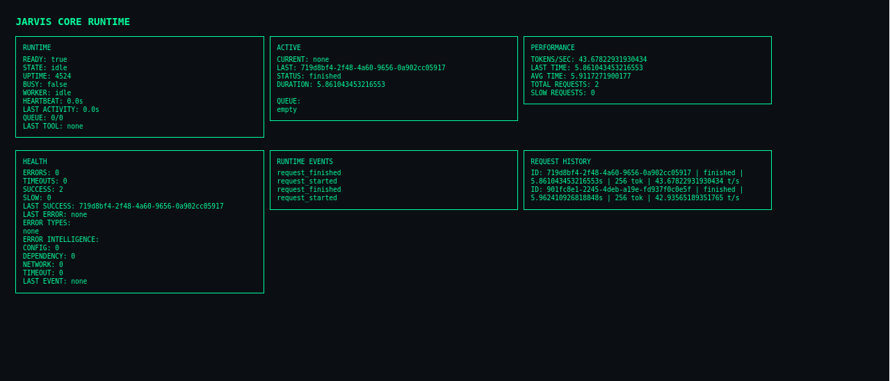

# Jarvis Core

Deterministic AI Runtime Infrastructure

Jarvis Core ist eine lokale AI Runtime Architektur mit Fokus auf Stabilität,
Observability und kontrollierte Execution anstatt autonomem Verhalten.

Dieses Projekt ist kein Chatbot, sondern eine Runtime Engine für AI Execution.

---

# Runtime Status

Runtime Core: Stable
Error Intelligence: Stable
Observability: Stable
Architecture: Stabilized

Current Phase:

Phase 4 – Error Intelligence Layer ✔

Next Phase:

Phase 5 – Runtime Intelligence Layer

Project Direction:

Jarvis entwickelt sich zu einem deterministischen AI Runtime System
mit Fokus auf Stabilität, Transparenz und kontrollierte Execution.

Nicht Ziel:

Autonomous Agents
Self modifying AI
Unkontrollierte AI Behaviour

Ziel:

Runtime Infrastruktur.

---

# Runtime Dashboard

Jarvis Runtime Status Interface:

# Release Status

Release: 0.2 – Runtime Hardening

Aktueller Stand:

Stable Runtime Core
Health Monitoring vorhanden
Runtime Events vorhanden
Error Tracking vorhanden
Error Intelligence vorhanden
Runtime Hardening abgeschlossen
Dashboard vorhanden

Nächster Schritt:

Phase 5 – Runtime Intelligence Layer

---

# Projektziel

Jarvis Core soll eine stabile AI Runtime Infrastruktur werden.

Fokus:

Deterministische Execution
Runtime Observability
Health Intelligence
Execution Control
System Stability

Nicht Fokus:

Agent Behaviour
Autonomous AI
Self modifying Systems

Jarvis soll Infrastruktur sein.

---

# Architektur Überblick

Jarvis folgt einer klaren Schichtenarchitektur:

API Layer
Service Layer
Runtime Layer
Worker Loop
Inference Engine

Execution Flow:

Request
→ Queue
→ Worker
→ Runtime Update
→ Metrics
→ History
→ Idle

Runtime Feedback Flow:

Worker
→ Error Intelligence
→ Health Evaluation
→ Status Service
→ Dashboard

---

# Architecture Diagram

Jarvis Runtime Flow:

Client Request  
→ Queue  
→ Worker  
→ Runtime State  
→ Error Intelligence  
→ Runtime Health  
→ Status Service  
→ Dashboard  

Detailed runtime architecture:

[Architecture Overview](docs/architecture.md)

# Kern Komponenten

Runtime Core:

RuntimeState
RuntimeWorker
RuntimeHealth
RuntimeErrors
RuntimeAutomation

Execution:

Inference Engine
Queue System
Reasoning Engine

Observability:

Metrics
Runtime Events
Health System
Dashboard

Control:

Status Service
Runtime Service
Inference Service

---

# Design Prinzipien

Jarvis folgt festen Engineering Prinzipien:

Stabilität vor Geschwindigkeit
Observability vor Magie
Determinismus vor Zufall
Architektur vor Features
Single Source of Truth
Klare Ownership von State

Jarvis soll erklärbar bleiben.

---

# Runtime Health System

Health basiert auf:

Error Rate
Timeout Rate
Queue Pressure
Worker Status
Slow Requests
Error Categories

Health States:

healthy
busy
degraded
error

Health ist ein berechneter Zustand.
Nicht manuell gesetzt.

---

# Runtime Observability

Jarvis verfolgt:

Runtime State
Worker Status
Queue State
Performance Metrics
Errors
Error Intelligence
Runtime Events
Request History

Ziel:

Runtime jederzeit verstehen können ohne Logs lesen zu müssen.

---

# Runtime Events

Jarvis speichert wichtige Runtime Aktionen:

request_started
request_finished
request_error
health_change
worker_stall
error_spike
critical_error

Das bildet die Grundlage für spätere Runtime Intelligence.

---

# Aktuelle Features

Runtime Worker Loop
Health Monitoring
Error Tracking
Error Intelligence
Metrics System
Runtime Events
Dashboard
Docker Setup

---

# Projektstruktur

jarvis-core/

ai/jarvis-ai/app/

dashboard/
inference/
services/
memory/
config/
error/

scripts/

---

# Start (lokal)

Requirements:

Docker
Docker Compose
Linux empfohlen

Start:

docker compose up -d

Status prüfen:

curl localhost:8002/status

Dashboard:

Browser öffnen:

http://localhost:8002/dashboard/status.html

---

# Entwicklungsstatus

Phase 1 – Execution Core ✔
Phase 2 – Observability ✔
Phase 3 – Runtime Intelligence Foundation ✔
Phase 4 – Error Intelligence ✔
Phase 5 – Runtime Intelligence (next)

---

# Architektur Ziel

Jarvis soll werden:

Eine stabile AI Runtime.

Nicht:

Ein AI Agent.

Nicht:

Ein autonomes System.

---

# Philosophie

Jarvis wird gebaut wie:

Ein Runtime Kernel
Ein Scheduler
Eine Datenbank Engine
Ein Observability System

Nicht wie:

Ein Chatbot
Ein AI Experiment
Ein Spielzeug

---

# Lizenz

Aktuell keine Open Source Lizenz.

Code dient als Architekturprojekt und Lernprojekt.

Source sichtbar.
Nutzung nicht freigegeben.

---

# Status

Jarvis Core:

Runtime Foundation erreicht.
Error Intelligence stabilisiert.

Nächster Meilenstein:

Runtime Intelligence Layer.

---

# Usage

This repository is currently source-visible only.

Purpose:

Architecture documentation
Learning reference
Development history

Not intended for production use or redistribution.

License may be added in future versions.

